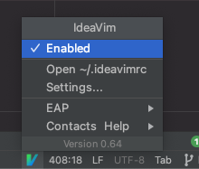
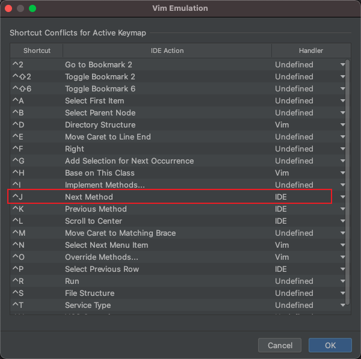

整理从0到1使用Mac系统, 提高生产力第一步, 学会良好的使用工具.

<!-- more -->

今天由于电池问题, 换了一波电脑, big sur系统, 之前打算升级来着一直怕有兼容性问题, 不过今天实际体验了下, 目前没有遇到什么问题, 这里顺带写一些装电脑细节, 便于快速整理恢复系统细节.

- [TODO](#todo)
- [Terminal](#terminal)
- [软件篇](#软件篇)
- [开发篇](#开发篇)
  - [Goland](#goland)

## TODO

- [ ] Terminal
- [ ] 软件篇
- [ ] 开发篇

## Terminal

- brew
- iTerm2
- Ohmyzsh
- Vim
- Git
- tmux

## 软件篇

- appcleaner
- sogouinput
- Google-chrome
- wechat
- Qq
- neteasemusic
- Eventnote
- dingtalk
- [Dozer](https://github.com/Mortennn/Dozer): 隐藏图标(开源软件)

## 开发篇

### Goland

插件篇:

ideaVim快捷键冲突, 或者不生效的修改.

